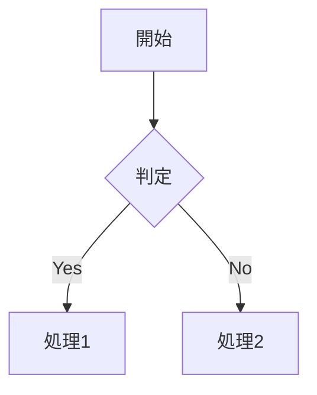

Docusaurusを使い始めたばかりの方向けに、プロジェクトの構造と各ディレクトリの役割、そしてメンテナンス時の更新ポイントをまとめました。

<!--truncate-->

## はじめに

Docusaurusは、Meta（旧Facebook）が開発したモダンな静的サイトジェネレーターです。このブログ記事では、Docusaurusプロジェクトの構造を理解し、効率的にコンテンツを管理・更新する方法を解説します。

## プロジェクト構造の全体像

```
docusaurus-learning/
├── blog/                      # ブログ記事を管理
│   ├── 2024-01-01-first.md   # ブログ記事（日付-スラグ.md形式）
│   └── authors.yml           # ブログ著者情報
├── docs/                      # ドキュメントファイル
│   ├── intro.md              # ドキュメントのエントリーポイント
│   └── tutorial-basics/      # ドキュメントのカテゴリ分け
├── src/                       # カスタムReactコンポーネント
│   ├── components/           # 再利用可能なコンポーネント
│   │   └── HomepageFeatures/ # トップページの機能紹介セクション
│   ├── pages/                # カスタムページ（ルーティング自動）
│   │   ├── index.tsx         # トップページ (/)
│   │   └── markdown-page.md  # Markdownページ (/markdown-page)
│   └── css/                  # グローバルCSS
│       └── custom.css        # カスタムスタイル定義
├── static/                    # 静的ファイル（画像、フォントなど）
│   ├── img/                  # 画像ファイル
│   └── manifest.json         # PWAマニフェスト
├── docusaurus.config.ts       # メイン設定ファイル
├── sidebars.ts               # ドキュメントのサイドバー構造
├── package.json              # 依存関係とスクリプト
└── tsconfig.json             # TypeScript設定
```

## 各ディレクトリの詳細解説

### 1. `/blog` - ブログ記事の管理

ブログ記事は時系列で管理され、自動的にブログページに表示されます。

**ファイル名の規則**:
- 形式: `YYYY-MM-DD-slug.md` または `YYYY-MM-DD-slug/index.md`
- 例: `2025-01-25-my-first-post.md`

**フロントマターの設定例**:
```yaml
---
slug: welcome-post              # URLに使用されるスラグ
title: Docusaurusへようこそ      # 記事タイトル
authors: [suguru]              # 著者（authors.ymlで定義）
tags: [docusaurus, hello]      # タグ（自動でタグページ生成）
image: ./thumbnail.png         # OGP画像
---
```

**画像の管理**:
- 記事と同じディレクトリに画像を配置
- 相対パスで参照: ``

### 2. `/docs` - ドキュメントの作成

構造化されたドキュメントを作成し、サイドバーで整理できます。

**ファイル名のベストプラクティス**:
- わかりやすい英語名を使用
- ケバブケース推奨: `getting-started.md`

**フロントマターの設定例**:
```yaml
---
id: getting-started            # 一意のID
title: はじめに                 # ページタイトル
sidebar_position: 1            # サイドバーでの表示順
sidebar_label: スタートガイド    # サイドバーに表示される名前
---
```

**カテゴリの作成**:
1. サブディレクトリを作成
2. `_category_.json`ファイルを追加:
```json
{
  "label": "チュートリアル",
  "position": 2,
  "link": {
    "type": "generated-index",
    "description": "基本的な使い方を学びましょう"
  }
}
```

### 3. `/src/pages` - カスタムページの作成

ファイル名が自動的にURLパスになる仕組みです。

**ルーティングの例**:
- `index.tsx` → `/`
- `about.tsx` → `/about`
- `team/index.tsx` → `/team`
- `contact.md` → `/contact`

**Reactページの例**:
```tsx
import React from 'react';
import Layout from '@theme/Layout';

export default function About() {
  return (
    <Layout title="About" description="About our project">
      <main>
        <h1>プロジェクトについて</h1>
        <p>ここにコンテンツを記述</p>
      </main>
    </Layout>
  );
}
```

### 4. `/src/components` - Reactコンポーネント

再利用可能なコンポーネントを作成します。

**命名規則**:
- PascalCase使用: `FeatureCard.tsx`
- 1ファイル1コンポーネント

**CSS Modulesの使用**:
```tsx
// FeatureCard.tsx
import styles from './FeatureCard.module.css';

export default function FeatureCard({ title, description }) {
  return (
    <div className={styles.card}>
      <h3>{title}</h3>
      <p>{description}</p>
    </div>
  );
}
```

### 5. `/static` - 静的アセット

ビルド時にそのままコピーされるファイルを配置します。

**アクセス方法**:
- ファイル: `/static/img/logo.png`
- URL: `/img/logo.png`（`/static`は省略）

## メンテナンスのベストプラクティス

### 新機能を追加する時

1. **プラグインの追加**:
```bash
bun add @docusaurus/plugin-xxx
```

2. **設定の更新** (`docusaurus.config.ts`):
```typescript
plugins: [
  '@docusaurus/plugin-ideal-image',
  // 新しいプラグインを追加
]
```

### コンテンツを更新する時

1. **ドキュメントの追加**:
   - `/docs`に新規ファイル作成
   - `sidebars.ts`で表示位置を調整

2. **ブログの投稿**:
   - `/blog`に日付付きファイル作成
   - 画像は同じディレクトリに配置

3. **新しいページの追加**:
   - `/src/pages`にファイル作成（自動ルーティング）

### スタイルをカスタマイズする時

1. **グローバルスタイル**:
```css
/* src/css/custom.css */
:root {
  --ifm-color-primary: #25c2a0;
  --ifm-font-family-base: 'Noto Sans JP', sans-serif;
}
```

2. **ダークモード対応**:
```css
[data-theme='dark'] {
  --ifm-color-primary: #4dd0b8;
}
```

## 便利なプラグイン

このプロジェクトには、以下の便利なプラグインがインストール済みです：

### 1. Ideal Image Plugin
画像を自動的に最適化し、レスポンシブ対応します。

```jsx
import Image from '@theme/IdealImage';
import thumbnail from './thumbnail.png';

<Image img={thumbnail} />
```

### 2. PWA Plugin
Progressive Web App機能を追加し、オフラインでも動作可能にします。

### 3. Image Zoom Plugin
画像をクリックすると拡大表示される機能を追加します。

### 4. Mermaid Theme
マークダウン内でダイアグラムを描画できます。



## トラブルシューティング

### ビルドエラーが発生した場合
```bash
# キャッシュをクリア
bun run clear
# 再ビルド
bun run build
```

### 開発サーバーが起動しない場合
```bash
# ポートを変更して起動
bun start -- --port 3001
```

## まとめ

Docusaurusのプロジェクト構造を理解することで、効率的にドキュメントサイトを構築・管理できます。各ディレクトリの役割を把握し、適切にファイルを配置することが重要です。

このガイドを参考に、素晴らしいドキュメントサイトを作成してください！

## 参考リソース

- [Docusaurus公式ドキュメント](https://docusaurus.io/)
- [Docusaurus GitHub](https://github.com/facebook/docusaurus)
- [MDX公式サイト](https://mdxjs.com/)