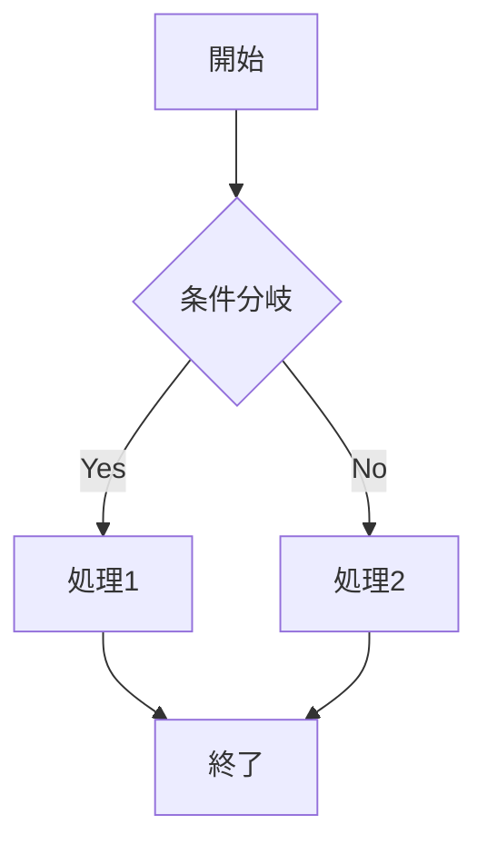

# マークダウン拡張機能

Docusaurusは標準的なマークダウンに加えて、多くの便利な拡張機能を提供しています。

## アドモニション（注意書き）

特別な注意を引くためのブロックを作成できます。

```markdown
:::note メモ
これは通常のメモです。
:::

:::tip ヒント
これは便利なヒントです。
:::

:::info 情報
これは追加情報です。
:::

:::warning 警告
これは警告メッセージです。
:::

:::danger 危険
これは危険な操作に関する警告です。
:::
```

### 実際の表示例

:::note メモ
これは通常のメモです。
:::

:::tip ヒント
これは便利なヒントです。
:::

:::warning 警告
これは警告メッセージです。
:::

## コードブロックの機能

### 行番号の表示

```javascript showLineNumbers
function fibonacci(n) {
  if (n <= 1) return n;
  return fibonacci(n - 1) + fibonacci(n - 2);
}

console.log(fibonacci(10)); // 55
```

### 特定の行をハイライト

```javascript {2,4-6}
function greet(name) {
  const greeting = `Hello, ${name}!`;
  console.log(greeting);
  
  // 複数行の
  // コメント
  // ハイライト例
  
  return greeting;
}
```

### タイトル付きコードブロック

```javascript title="src/utils/hello.js"
export function sayHello(name) {
  return `Hello, ${name}!`;
}
```

## タブ

複数の選択肢を表示する場合に便利です。

````markdown
import Tabs from '@theme/Tabs';
import TabItem from '@theme/TabItem';

<Tabs>
  <TabItem value="js" label="JavaScript" default>

```javascript
const greeting = "Hello, World!";
console.log(greeting);
```

  </TabItem>
  <TabItem value="py" label="Python">

```python
greeting = "Hello, World!"
print(greeting)
```

  </TabItem>
  <TabItem value="java" label="Java">

```java
String greeting = "Hello, World!";
System.out.println(greeting);
```

  </TabItem>
</Tabs>
````

## 折りたたみ可能なセクション

<details>
  <summary>クリックして展開</summary>
  
  ここに詳細な内容が入ります。
  
  - 項目1
  - 項目2
  - 項目3
</details>

```markdown
<details>
  <summary>クリックして展開</summary>
  
  ここに詳細な内容が入ります。
  
  - 項目1
  - 項目2
  - 項目3
</details>
```

## 数式（LaTeX）

インライン数式: `$E = mc^2$`

ブロック数式:

```
$$
\frac{n!}{k!(n-k)!} = \binom{n}{k}
$$
```

```markdown
インライン数式: $E = mc^2$

ブロック数式:
$$
\frac{n!}{k!(n-k)!} = \binom{n}{k}
$$
```

## Mermaidダイアグラム



````markdown

````

## 画像の配置

### 中央揃え

<div align="center">
  
</div>

### 横並び

<div style={{display: 'flex', gap: '20px'}}>
  
  
</div>

## カスタムコンテナ

<div style={{
  backgroundColor: '#f0f0f0',
  padding: '20px',
  borderRadius: '8px',
  marginBottom: '20px'
}}>
  カスタムスタイルを適用したコンテナです。
</div>

## フロントマターの活用

```yaml
---
sidebar_position: 1
title: ページタイトル
description: ページの説明
keywords:
  - キーワード1
  - キーワード2
tags:
  - タグ1
  - タグ2
hide_table_of_contents: false
---
```

## 内部リンク

- [はじめに](/docs/intro)
- [クイックスタート](/docs/getting-started)
- 相対パス: [./intro](./intro.md)

## 外部リンクの装飾

[外部サイト](https://example.com) ↗️

## ファイルのダウンロード

[サンプルファイルをダウンロード](/files/sample.pdf)

## まとめ

これらの拡張機能を活用することで、より表現力豊かで使いやすいドキュメントを作成できます。必要に応じて、さらにカスタムコンポーネントを作成することも可能です。